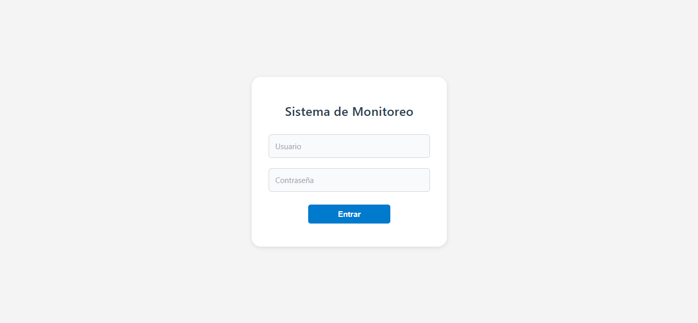
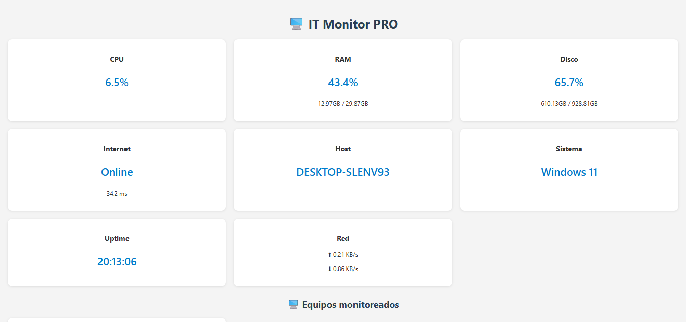

# IT Monitor PRO

Dashboard web en tiempo real para monitoreo de sistemas desarrollado con Python y Flask.
Desde cualquier navegador de la red local, muestra el estado completo de todos los equipos conectados.





## Features

- Monitoreo en tiempo real: CPU, RAM, disco, red, latencia y uptime
- Arquitectura cliente-servidor: cada equipo envía sus métricas cada 5 segundos
- Detección automática de equipos offline (sin respuesta en +15 segundos)
- Base de datos SQLite para persistir el historial
- Gráfico histórico de CPU y RAM con Chart.js

## 🛠️ Tecnologías

- Python
- Flask
- psutil
- SQLite
- Chart.js

## 🚀 Cómo correrlo

1. Cloná el repositorio
2. Creá un entorno virtual e instalá dependencias:
```bash
   python -m venv venv
   venv\Scripts\activate
   pip install -r requirements.txt
```
3. Corré el servidor:
```bash
   python app.py
```
4. Abrí `http://localhost:5000` en el navegador
5. En cada equipo a monitorear, corré:
```bash
   python client.py
```

## 🚧 En desarrollo

- 🔐 Login para acceso seguro al dashboard
- 📧 Alertas cuando un equipo se desconecta de la red
- 📊 Más métricas: temperatura, procesos activos y puertos abiertos
